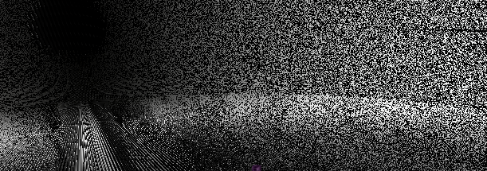
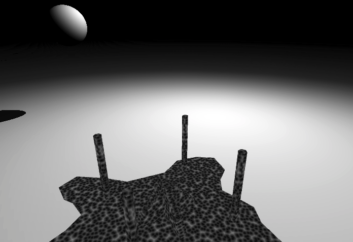
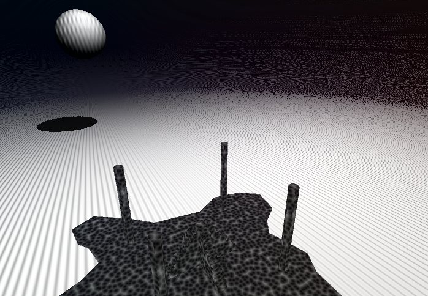
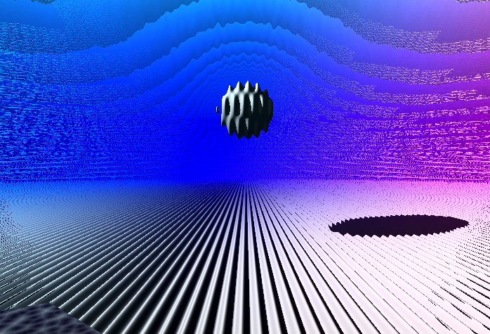
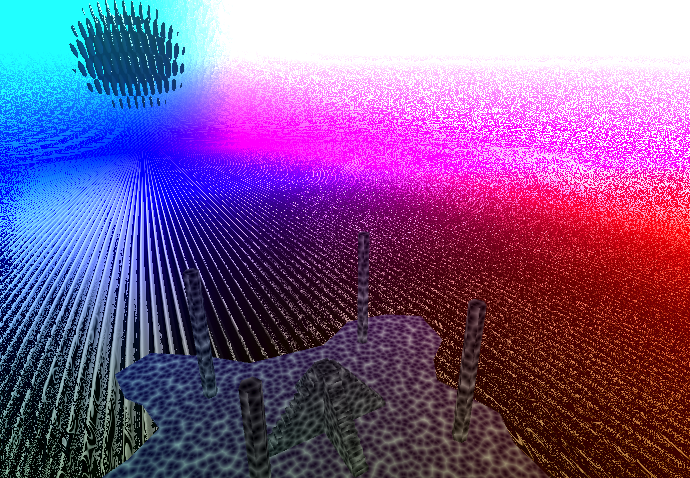
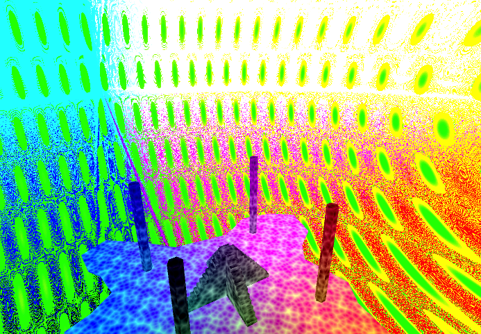
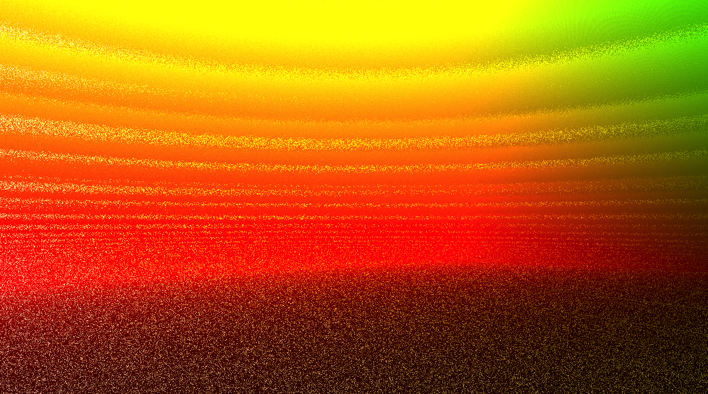

# Noisescape

Built in Unity for Oculus Quest.

This is an abstract landscape that slowly morphs into something very weird and colorful. 

## Shaders

This sketch is an early step in my journey of learning shaders. Made for this:
* Raymarching shader for moon-sphere and skybox
* Voronoi for floor and stairs
* Noisy pixel-ish shader for pillars

## Intensity

All the materials have an **_Intensity** parameter that is set globally in scene.

## But why?

For fun. And I think there is room for more colors, noise and weirdness in VR environments.

## Credits

Elaborating on ideas from tutorials by:
[Art of Code](https://www.youtube.com/channel/UCcAlTqd9zID6aNX3TzwxJXg)
[Freya Holmér](https://www.youtube.com/user/Acegikm0)
[The Book of Shaders](https://thebookofshaders.com/)

## Wrapping up

Would like to give this a few more visual passes and add some audio - so might continue elsewhere. As a sketch I'm calling it done.

